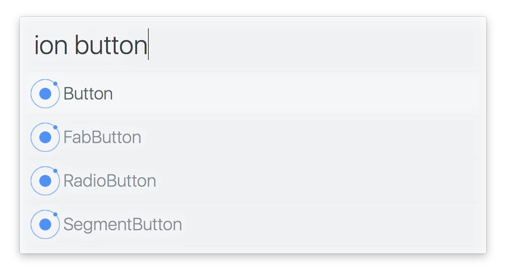

# arvis-ionic

> Arvis workflow to search through the Ionic documentation




## Install

```
$ npm install -g arvis-ionic
```


## Usage

In arvis, type `ion`, <kbd>Enter</kbd>, and your query.

Select an item and press <kbd>Enter</kbd> to go to its [Ionic](https://ionicframework.com/docs/) documentation.<br>
Press <kbd>Shift</kbd> to view the documentation in Quick Look.


## License

MIT © [Sam Verschueren](https://github.com/SamVerschueren)
